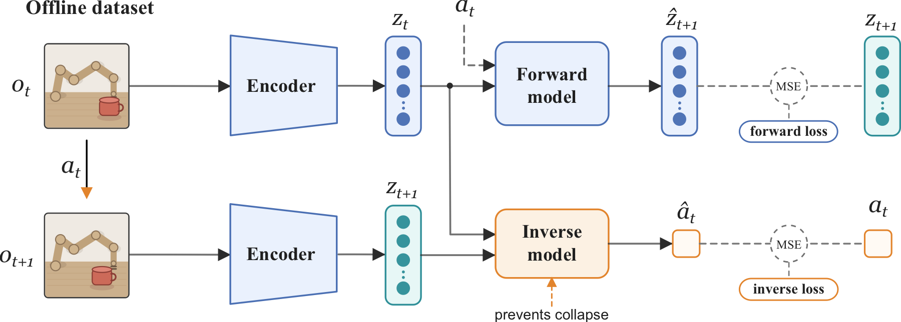

# Sensorimotor World Models
### Perception for Action via Inverse Dynamics

[Petr Ivashkov](https://openreview.net/profile?id=~Petr_Ivashkov1), [Randall Balestriero](https://openreview.net/profile?id=~Randall_Balestriero1) and [Bernhard Schölkopf](https://openreview.net/profile?id=~Bernhard_Sch%C3%B6lkopf1)

<p align="center">
  <b>[ <a href="https://arxiv.org/abs/2606.20104">Paper</a> ] · [ <a href="https://petr-ivashkov.github.io/sensorimotor-world-model.github.io/">Project page</a> ]</b>
</p>

<p align="center">
  
</p>

## TL;DR

We introduce a sensorimotor world model (SMWM): a latent world model trained end-to-end from
pixels with inverse dynamics regularization as the sole anti-collapse mechanism. Empirically,
SMWM learns interpretable low-dimensional representations and achieves competitive planning
performance across 2D and 3D tasks.

## Method

We train from transition tuples `(o_t, a_t, o_{t+1})`, where `o_t` is a pixel observation and
`a_t` is the action vector taken between consecutive frames. An encoder maps each observation to
a latent state, `z_t = f(o_t)`. On top of it we train two models jointly: a forward model that
predicts the next latent from the current latent and action, `ẑ_{t+1} = g(z_t, a_t)`, and an
inverse model that recovers the action from a pair of consecutive latents,
`â_t = h(z_t, z_{t+1})`. The joint loss is

`L = ||ẑ_{t+1} - z_{t+1}||² + λ·||â_t - a_t||²`

with `λ` controlling the inverse term, which prevents representation collapse.

## Repository structure

Two self-contained subprojects share the method but target different settings:

| Subproject | What it is |
|---|---|
| [`toy/`](toy/) | A simple instantiation of SMWM in a 2D dot-world — the place to experiment and build intuition for what structure the model learns. |
| [`planning/`](planning/) | SMWM on richer 2D/3D environments (TwoRoom, Reacher, Push-T, OGBench-Cube) with the downstream planning application. Reproduces the paper's results. Needs a single CUDA GPU. |

A single environment at the repo root covers both subprojects:

```bash
uv sync                      # creates ./.venv (Python ≥ 3.13)
source .venv/bin/activate
```

> On macOS/arm64 the `toy/` half installs and runs as-is; the `planning/` half pulls
> simulator dependencies that build only on Linux + CUDA (where those experiments run).

## Instructions

- **Just try the method** → [`toy/`](toy/README.md):
  ```bash
  cd toy && python train.py --config experiments/single_dot/config.yaml
  ```
- **Reproduce the paper** (requires single CUDA GPU + datasets) → [`planning/`](planning/README.md). See [reproduction documnetation](planning/README.md#reproduce).

## Citation

```bibtex
@misc{ivashkov2026sensorimotor,
  title         = {Sensorimotor World Models: Perception for Action via Inverse Dynamics},
  author        = {Ivashkov, Petr and Balestriero, Randall and Sch{\"o}lkopf, Bernhard},
  year          = {2026},
  eprint        = {2606.20104},
  archivePrefix = {arXiv},
  primaryClass  = {cs.LG},
  url           = {https://arxiv.org/abs/2606.20104}
}
```

## License

Released under the MIT License ([`LICENSE`](LICENSE)). The `planning/` subproject derives
from LeWorldModel — see [`planning/README.md`](planning/README.md#credit) for attribution.
